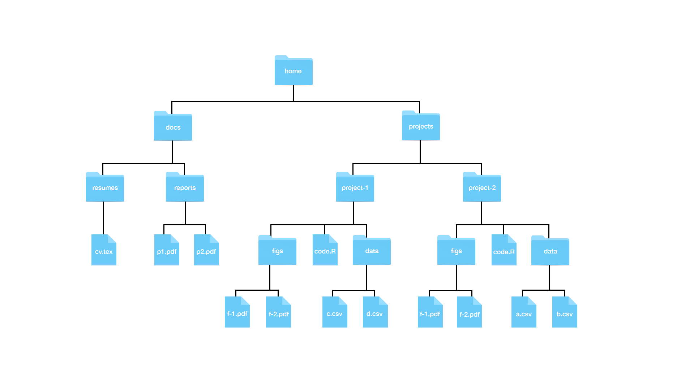

###Using Unix

**The Terminal**

Access a terminal window in R via Tools > Terminal > New Terminal.

The following function can be run in the terminal screen which returns the string in quotes:

`echo "hello world"`

*hello world*

**Recommended Directory Structure**

 


###Unix Commands

**Working Directory**  

* `pwd` prints the *full path* current working directory  
* `~` is a shorthand for within the current directory (e.g. `~/docs` in your working directory)
    + `cd ~/docs` will take us to `docs` no matter where it is relative to the current directory
* `ls` lists directory content  
* `mkdir` creates a new directory within the current working directory  
* `rmdir` removes a directory as long as it's empty
* `cd` changes the working directory to the directory specified after it (e.g. `cd projects`) 
    + `cd ~` returns you to the root (first parent) directory  
    + `cd ..` returns you to the parent directory one step above the working directory  
    + `cd .` keeps you in the current directory (`.` is a shorthand for the current directory)
    + `cd ../..` will take you to the parent of the parent of the working directory!
    + `cd -` returns you to the directory you just left
    + `cd` alone also returns you to the home directory
    + note: be sure to but `/` at the end of the directory you want to move to!
    
**Adding, Moving and Looking at Files**

* `mv` moves files or directories between directories as well as changing filenames  
    + e.g. `mv ~/docs/resumes/cv.tex ~/docs/reports/` moves `cv.tex` from `resumes` to `reports`
    + e.g. once in the working directory, `mv cv.tex resume.tex` changes the filename
    + note: to move a directory or file, ensure that there is a `/` at the end of your                 destination else the filename will change!
    + note: `mv` will replace a file without warning if you move a new one of the same name to         the same directory
* `cp` copies files into other directories with the same syntax as `mv`  
    + note: `cp` cannot copy directories without an argument  
* `rm` *permanently* removes files
    + note: one can list multiple files to remove simulataneously
    + note: to remove a directory requires an argment
* `less` shows the contents of a file
    + `q` exits the file viewer
    
**Preparing for a Data Science Project**

* Create all of the directories you need first
    + note: This is much easier than reorganizing after the fact!
* Avoid using the `~` in to specify file paths in your code so that it is easier to implement on other machines  


###Reproducible Reports

**Preparing Your Data**

1. Create a new project within a directory (connect with Git for version control)
    + click on *New Project..* under *File* to get started
2. Create subdirectories `R_data` and `raw_data` for your raw and prepared datasets
    + use the `mkdir` command, Finder, or the Rstudio interface
3. Download the relevant files into your `raw_data` folder, modify it to the form in which you will use it, and then save it is a `.rda` file (`.Rdata` also works, but Rafa recommends `.rda`).

Here's an example:

```{r, eval = FALSE}
#in first data file:
url <- "https://raw.githubusercontent.com/rafalab/dslabs/master/inst/extdata/murders.csv"
dest_file <- "raw_data/murders.csv"
download.file(url, destfile = dest_file)

#in second data file:
library(tidyverse)
murders <- read.csv("raw_data/murders.csv")
murders <- murders %>% mutate(region = factor(region), rate = total/population*10^5)
save(murders, file = "R_data/murders.rda")
```

Now your data is saved as an `rda` file which can easily be loaded into the global environment.

4. Analysis! Analyze your data in a new R script (say, one called "analysis.R") located in your working directory. 
5. Save the plots from your analysis using `ggsave` into a folder within your project. 

Here's an example:

```{r, eval = FALSE}
library(tidyverse)
load("R_data/murders.rda")
murders %>% mutate(abb = reorder(abb, rate)) %>%
  ggplot(aes(abb, rate)) +
  geom_bar(width = 0.5, stat = "identity", color = "black") +
  coord_flip()
ggsave("figures/barplot.png")
```

Now the plot is saved as a `png` in the `figures` subdirectory in your project directory. (The `figures` directory was created beforehand with `mkdir` or the RStudio interface.)

**R Markdown**

R markdown documents are useful because they combine code and text into the same document, and can be compiled to automatically create documents plots and their accompanying discussion. Create a new one by selecting R markdown from the new file dropdown list. It is recommend that you leave the output format to HTML because this is the preferred debugging platform. Note that this is easily changed later if you prefer a PDF or a Word document.

* Add a name to each of your R chunks (e.g. r pressure-summary) in your chunk headers to make finding the specific analyses easier  
* Use the header to define the title, author, and date -- as well as the output format and other customizations
* Changing the output to a *github_document* will change the suffix to `.md` which will make the document render nicely on GitHub! 
* Useful resources for R markdown:
    + rmarkdown.rstudio.com
    + yihui.name/knitr/
  
###Git and GitHub

The following barely scratches the surface on using Git and Github. Checkout these resources for more information:
    + Codeacademy
    + GitHub Guides
    + Try Git Tutorial
    + Happy Git and GitHub for the UseR

**Cloning a repository with the terminal**

1. Copy the url of the directory in Github.
2. Make a directory in terminal where the cloned repository will go
3. Use the function `git clone` followed by the `url` to clone the repository
    + note: cloning copies the the files in the repository along with the structure into the 3 local stages: the working directory, the staging area, and the local repository


**Working with a repository**

* Files edited in Rstudio are changed only in the working directory
    + Git can tell you how files relate to the other areas with the function `git status`
* Using the repository:
    + The *working directory* has all of the edits you make
    + The *staging area* has all of the edits you make, but doesn't save previous versions
    + The *local repository* isn't shared, but does keep track of versions -- only save important changes here, not every little thing
    + The *remote repository* is the shared central repository for final versions and backups -- save versions that you want to share here
* Using the terminal to update the repository
    + `git add example.csv` will stage the file
    + `git commit` will commit any staged files to the local repository; files can be commited directly if the filename is specified after `commit`
    + `git push` updates the remote repository based on the local repository, assuming you have editing priviledges
    + `git status` shows you the status of the files in your repository
    + `git log` shows you the history of the commits to the local repository
    + `git fetch` updates the local directory based on the remote repository
    + `git merge` updates the working directory and staging area based on the local repository
    + `git pull` is equivalent to `git fetch` followed by `git merge`
* Creating a GitHub Repository for an Existing Directory
    + Use `cd` to enter the correct directory
    + `git init` will initialize the directory to become a local repository
    + `git remote add origin https://github.com/you/therepository` will connect your local repository with a remote repository that you've already created on GitHub (and for which you've provided a URL)
    
Here's an example wherein a new file called README.txt is created with text contains specified. The current working directory is then initialized; README.txt is added to it, and then commited to the local repository. A remote repository is connected and then the local repository is pushed to the remote.

    echo “A new repository with my scripts and data” > README.txt  
    git init    
    git add README.txt   
    git commit -m "First commit. Adding README file."  
    git remote add origin https://github.com/user123/repo123.git   
    git push
    
###More Unix

**Arguments**

* `-r` after a command makes it operate *recursively* (e.g. `rm -r folder` removes the folder and any files or subfolders it might contain)
* `-f` *forces* a command to occur, even if a file is protected
* `-a` stands for *all* and is useful with `ls` since it shows hidden files as well
* `-l` stands for *long* and is useful with `ls` since it shows more info about the files in a directory 
* `-t` also operates in concert with `ls`, putting files in chronological order
* `-r` reverses the order of files

It is possible to combine arguments. If wanted to show more info for all files in reverse chronological order, we could write `ls - lart`.

**Getting Help (and the Pipe)**

Unix has manuals describing the available commands and how to use them. Simply type `man ls` to get the manual for `ls`.

We can use the pipe, `|`, to pipe the result of one command into the next (similar to `%>%` in R). For example `man ls | less` pipes the manual for `ls` into `less` which reproduces the manual in the easier-to-navigate file viewer.

**Wildcards**

* The asterisk, `*`, can be used to indicate "anything can go here". For example, `ls*.html` shows all html files in the current directory.
* The question mark, `?`, denotes "any character". For example, if all the files you wanted to erase had the format file-001, you could use `rm file-???.html` to only erase files that have that format.
* The two wildcards above can be combined (e.g. `rm file-???.*`) removes all files with the file-001 format regardless of suffix.

**Environment Variables and Shells**

Unix has settings that affect your command line environment called environment variables. Variables are distinguished from other entities by the `$`. The home directory is stored in `$HOME`, while the shell is stored in `$SHELL`. You can see the paths for these by entering `echo` before them in the command line. You can implement `.bash` commands that run everytime you start.

**Executables, Permissions and File Types**

* `which` shows the directory in which a file resides  
* `$PATH` shows how Unix finds executables such as `git` and `ls` that you call  
* Typing `ls -l` will show a string of letters at the beginning of the file that indicate   whether it is readable, writable, or executable and which users have access to it  

**Commands You Should Learn**

* `open` tries to pick the right application to open a file
* `nano` opens a bare-bones editor
* `ln` creates symbolic links
* `tar` lets you create or extract archives
* `ssh` lets you connect to other computers
* `grep` lets you search for patterns in a file or files
* `awk` and `sed` allow to find specific strings in files and change them
* You can use these through R with `system`


    


    
    


