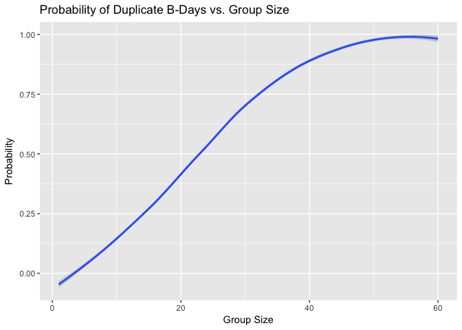
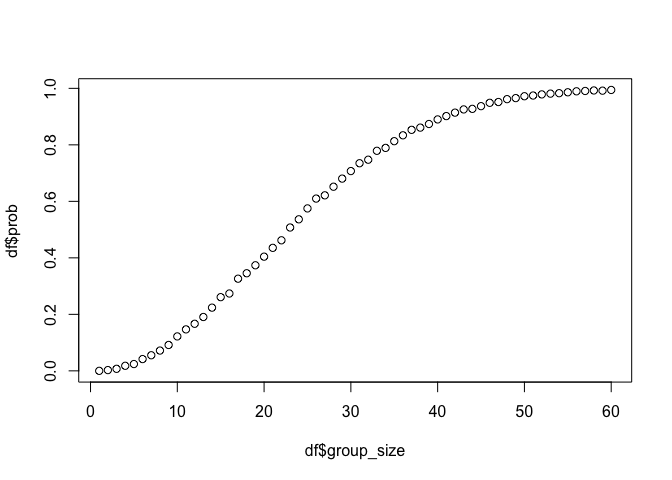
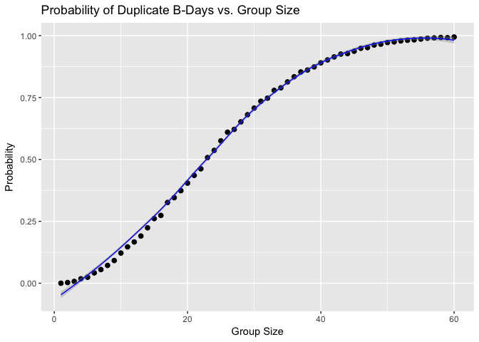
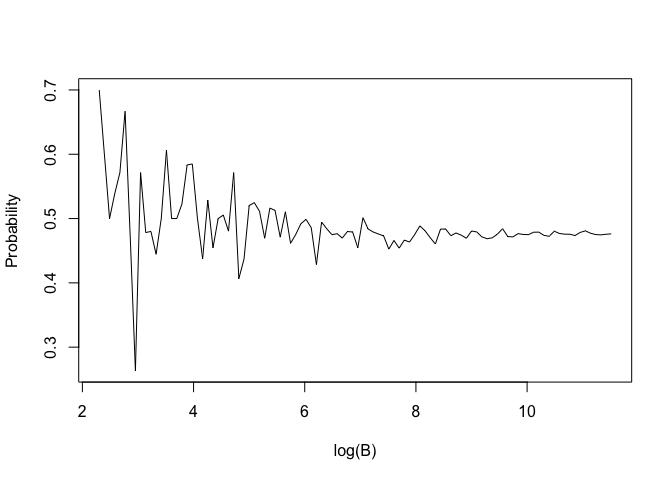
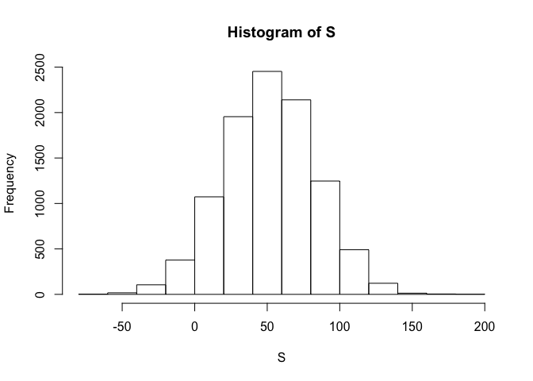
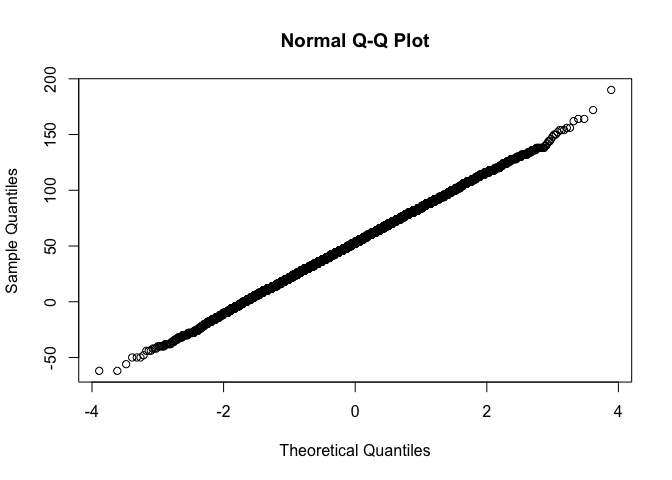
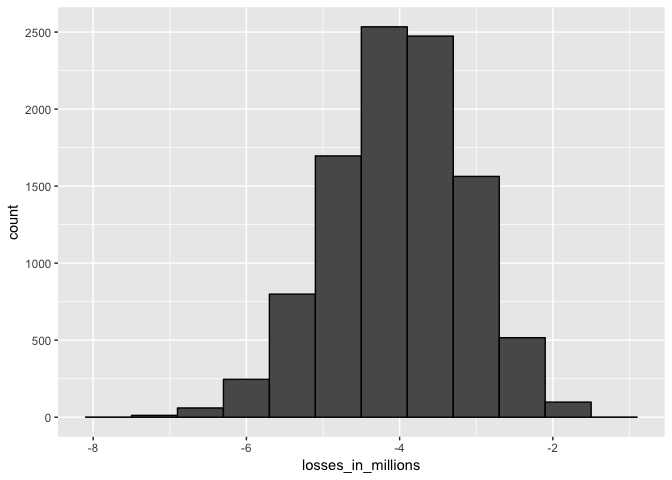
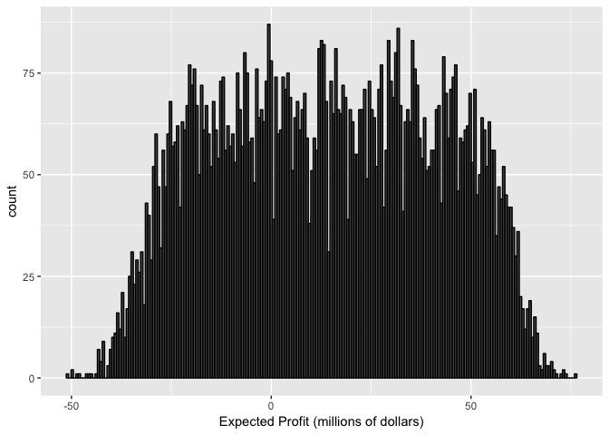

R Probability Course
================
Will Duke

Discrete Probability
--------------------

### Monte Carlo Simulations

It's often useful to get a sense of what to expect in aggregate when many events occur under the same conditions. A `Monte Carlo simulation` involves simulating many repeated events with the same probability to approximate what happens in the limit.

``` r
beads <- rep(c("blue", "red"), times = c(2,3))
sample(beads, 1)
```

    ## [1] "red"

``` r
b <- 10000
events <- replicate(b, sample(beads, 1))
tab <- table(events)
prop.table(tab)
```

    ## events
    ##   blue    red 
    ## 0.4046 0.5954

Here we can see that simulating pulling a bead out of a bag with 2 blue and 3 red beads 10,000 times accurately approximates the expected probabilities: 0.4 for blue and 0.6 for red.

The above case is demonstrative, but Monte Carlo simulations are more useful when it is harder to compute the exact probabilities of events.

Note also that the function `sample()` can select multiple elements, but by default this occurs *without replacement*. If we replaced the 1 above with a five we'd get 2 reds and 3 blues in random order, but inputting a 6 would return an error. We can use replament by adding an argument to `sample()`:

``` r
events <- sample(beads, b, replace = TRUE)
prop.table(table(events))
```

    ## events
    ##   blue    red 
    ## 0.4026 0.5974

As you can see, we get very similar answers as we did with the `replicate()` function.

### Probability Functions

For categorical variables, the probability function is simply the function assigned to each category (e.g. 44% Democrat, 44% Republican, and 8% independent).

### Independence

Two events are **independent** if the outcome of one does not affect the other.

When events are not independent, we use conditional probabilities to account for the effects of preceding events using the following notation (in this example, for the probability that the second card picked from the deck is a king given that the first was).

$Pr(Card 2 is a king | Card 1 is a king) = \\frac{3}{51}$

Some rules:

1.  Independence Rule:

If two events are independent, *P**r*(*A*|*B*)=*P**r*(*A*)

1.  Multiplication Rule:

The probability of two events occurring is the product of their probabilities.

*P**r*(*A**a**n**d**B*)=*P**r*(*A*)*P**r*(*B*|*A*)

### Combinations and Permutations

With combinations, order doesn't matter. With permutations, it does!

``` r
#Useful functions
#Paste combines strings into longer strings
number <- "Three"
suit <- "Hearts"

paste(number, suit)
```

    ## [1] "Three Hearts"

``` r
#expand.grid gives all possible combinations
expand.grid(pants = c("blue", "black"), shirt = c("white", "grey", "plaid"))
```

    ##   pants shirt
    ## 1  blue white
    ## 2 black white
    ## 3  blue  grey
    ## 4 black  grey
    ## 5  blue plaid
    ## 6 black plaid

Let's construct a deck of cards using the functions above.

``` r
suits <- c("Diamonds", "Clubs", "Hearts", "Spades")
numbers <- c("Ace", "Deuce", "Three", "Four", "Five", "Six", "Seven", "Eight", "Nine", "Ten", "Jack", "Queen", "King")
deck <- expand.grid(number = numbers, suit = suits)
deck <- paste(deck$number, deck$suit)
```

What's the probability that you draw a king?

``` r
kings <- paste("King", suits)
mean(deck %in% kings)
```

    ## [1] 0.07692308

``` r
library(gtools)
```

In the `gtools` package, `permutations` computes for any list of size `n` all the different ways we can select `r` items.

For example, here are all the ways we can select two items from a list of 5.

``` r
permutations(5,2)
```

    ##       [,1] [,2]
    ##  [1,]    1    2
    ##  [2,]    1    3
    ##  [3,]    1    4
    ##  [4,]    1    5
    ##  [5,]    2    1
    ##  [6,]    2    3
    ##  [7,]    2    4
    ##  [8,]    2    5
    ##  [9,]    3    1
    ## [10,]    3    2
    ## [11,]    3    4
    ## [12,]    3    5
    ## [13,]    4    1
    ## [14,]    4    2
    ## [15,]    4    3
    ## [16,]    4    5
    ## [17,]    5    1
    ## [18,]    5    2
    ## [19,]    5    3
    ## [20,]    5    4

Let's say we want to create 5 different random phone numbers. The following code produces all possible 7-digit phone numbers (without repeats), selects 5 at random, and presents them in a table.

``` r
all_numbers <- permutations(10,7, v = 0:9)
n <- nrow(all_numbers)
index <- sample(n, 5)
all_numbers[index,]
```

    ##      [,1] [,2] [,3] [,4] [,5] [,6] [,7]
    ## [1,]    8    5    9    0    3    6    4
    ## [2,]    7    0    3    5    4    6    9
    ## [3,]    3    8    0    2    7    5    4
    ## [4,]    8    6    3    1    9    0    4
    ## [5,]    8    6    9    5    1    3    0

Back to the deck. Let's compute all the possible ways we could draw two consecutive cards from the deck.

``` r
hands <- permutations(52,2, v = deck)
```

We can see from the number of rows in `hands` that there are 2652 possible pairs of cards we could select. Below, we generate the probability of drawing a second king after drawing a first. As expected, $0.05... = \\frac{3}{51}$.

``` r
first_card <- hands[,1]
second_card <- hands[,2]
sum(first_card %in% kings)
```

    ## [1] 204

``` r
sum(first_card %in% kings & second_card %in% kings)/sum(first_card %in% kings)
```

    ## [1] 0.05882353

Let's compute the probability of drawing a 21-point hand in blackjack (an ace and a facecard or ten).

``` r
#generate vector with Aces
aces <- paste("Ace", suits)
#generate vector with facecards
facecard <- c("King", "Queen", "Jack", "Ten")
facecard <- expand.grid(number = facecard, suit = suits)
facecard <- paste(facecard$number, facecard$suit)
#count how often to do we get aces and a facecard in two draws (where order doesn't matter)
hands <- combinations(52,2, v = deck)
mean((hands[,1] %in% aces & hands[,2] %in% facecard))
```

    ## [1] 0.04826546

``` r
#mean considering ace in second column and vice versa
mean((hands[,1] %in% aces & hands[,2] %in% facecard) | (hands[,2] %in% aces & hands[,1] %in% facecard))  
```

    ## [1] 0.04826546

Note that we assume above that aces come first. We can do this because we know that `combinations()` will consider `Aces` first because of the way it enumerates combinations. To account for the possibility that the ace appears in the second column of the output from `combinations()`, we will can use the second `mean()` above.

Also note the syntax use to express `OR` above.

Let's now estimate the probability with a Monte Carlo simulation.

``` r
hand <- sample(deck, 2)
hand
```

    ## [1] "Queen Clubs"    "Seven Diamonds"

``` r
b <- 10000
results <- replicate(b, {
  hand <- sample(deck, 2)
 (hand[1] %in% aces & hand[2] %in% facecard) | (hand[2] %in% aces & hand[1] %in% facecard)
})
mean(results)
```

    ## [1] 0.0472

Here we create a randomly selected two-card hand with `sample()`, and then `replicate()` that random drawing `b` times before calculating the fraction of hands where the two cards are an ace and a facecard or ten.

### The Birthday Problem

Suppose you're in a classroom with 50 people. What is the chance that two people share a birthday?

Let's assume that nobody was born on February 29th for simplicity's sake, and then run a Monte Carlo simulation.

The days of the year can be represented as numbers with `sample()`.

``` r
n <- 25
bdays <- sample(1:365, n, replace = TRUE)
#duplicated returns true if a value has already appeared in a vector
results <- replicate(b,{
  bdays <- sample(1:365, n, replace = TRUE)
  any(duplicated(bdays))
})
mean(results)
```

    ## [1] 0.5785

Let's create a lookup table to find out what the odds of there being two people with the same birthday within a group.

``` r
#create a function where we compute via Monte Carlo simulation the probability of a duplicate (in 1:365) occuring in a group of size n
compute_prob <- function(n, B = 10000){ 
  same_day <- replicate(B, {
    bdays <- sample(1:365, n, replace = TRUE)
    any(duplicated(bdays))
  })
  mean(same_day)
}

#note that this function does not work element-wise since it is expecting a scalar
n = seq(1,60)
results <- sapply(n, FUN = compute_prob)
df <- data.frame(group_size = n, prob = results) 
df %>% ggplot(aes(group_size, prob)) +
  geom_smooth() + xlab("Group Size") + ylab("Probability") +
  ggtitle("Probability of Duplicate B-Days vs. Group Size")
```

    ## `geom_smooth()` using method = 'loess'



``` r
plot(df$group_size,df$prob)
```



`sapply()` allows us to perform element-wise operations using any function! Above, we applied `compute_prob()` to the vector of integers from 1 to 60 using sapply, and plotted the results in a table.

Now let's generate the graph again by calculating the exact probabilities. We'll do this backwards by calculating the probability that a person does not have the same birthday, and then using the `multiplication rule`.

*P**r*(*p**e**r**s**o**n*1*h**a**s**u**n**i**q**u**e**b**i**r**t**h**d**a**y*)=1

*P**r*(*p**e**r**s**o**n*2*h**a**s**u**n**i**q**u**e**b**i**r**t**h**d**a**y*|*P**r*(*p**e**r**s**o**n*1*h**a**s**u**n**i**q**u**e**b**i**r**t**h**d**a**y*)) = 364/365

$Pr(person 3 has unique birthday | Pr(person 1 & 2 have unique birthdays)) = 363/365$

Using the `multiplication rule`, we see that the probability that everybody's birthday is unique is multiplied by $\\frac{365 - (n-1)}{365}$ for the nth person in the group.

Let's use this function to find the exact probability of a duplicate birthday in each group.

``` r
exact_prob <- function(n){
  prob_unique <- seq(365, 366-n)/365
  1 - prod(prob_unique)
}
eprob <- sapply(n, exact_prob)
df$eprob <- eprob
df %>% ggplot(aes(group_size, prob)) +
  geom_point(size = 2) + xlab("Group Size") + ylab("Probability") +
  ggtitle("Probability of Duplicate B-Days vs. Group Size") +
  geom_smooth(aes(group_size, eprob), color = "blue", size = 0.5)
```

    ## `geom_smooth()` using method = 'loess'

 Above, we created a function that created a sequence of fractions based on n and then took the product of the sequence. Note that the sequence starts at `365` and goes to `366-n`, giving us the exact probability for each group size.

### How many Monte Carlo experiments are enough?

Short answer: it's tough to know in practice. We can get a sense though by estimating the stability of our estimate.

``` r
B <- 10^seq(1,5, len = 100)
compute_prob_mc <- function(B, n = 22){ 
  same_day <- replicate(B, {
    bdays <- sample(1:365, n, replace = TRUE)
    any(duplicated(bdays))
  })
  mean(same_day)
}
prob_mc <- sapply(B, compute_prob_mc)
plot(log(B), prob_mc, type = "l", ylab = "Probability")
```



Not how as `B` gets larger, the estimate begins to stabilize. We can be more confident that an approximation that returns a similar value each time it is run is accurate.

### Addition Rule

$Pr(A | B) = Pr(A) + Pr(B) - Pr(A & B)$

Note that we subtract the probability of both occuring because that is contained within the first two terms.

For the facecard example, the probability of drawing an ace and then a facecard is:

$\\frac{1}{13} \* \\frac{16}{51} = \\frac{16}{663} = 0.24..$

and the probability of drawing a facecard and then an ace is:

$\\frac{16}{52} \* \\frac{4}{51} = \\frac{64}{2652} = 0.024..$

Note that these are the same, which makes sense given the symmetry of the choices.

It's not possible to have both circumstances occur, so the Pr(A & B) = 0, and thus we can add the probabilities above to find the probability of either occuring:

Pr(facecard then ace | ace then facecard) = 0.024.. + 0.024.. = 0.048..

### The Monty Hall Problem

Monty shows you three doors. Behind them, one has a prize and the other two have goats. You choose one. Monty opens a door and shows you that there is a goat behind it, and offers you the chance to switch your guess. Do you?

Let's create a Monte Carlo simulation to find out what the best strategy is. Note that the following code is longer than it needs to be to demonstrate the concept.

**The Stick Strategy**

``` r
B = 10000
stick <- replicate(B, {
  doors <- as.character(1:3)
  prize <- sample(c("car", "goat", "goat" ))
  prize_door <- doors[prize == "car"]
  my_pick <-sample(doors,1)
  show <- sample(doors[!doors %in% c(my_pick, prize_door)],1) #you're shown a door but don't change
  stick <- my_pick #same as above; this and above line don't change anything
  stick == prize_door
})
mean(stick)
```

    ## [1] 0.3377

Here, we walk through it with our code. We set the doors to be 1:3, randomly order where the prize is, pick one of the doors at random, ignore the door we are shown, and stick with our original pick. You started out picking 1 out of 3; nothing change, and now the odds are still 1 out of 3.

**The Switch Strategy**

Now let's estimate the likelihood of picking the prize door when you switch.

``` r
B = 10000
switch <- replicate(B, {
  doors <- as.character(1:3)
  prize <- sample(c("car", "goat", "goat" ))
  prize_door <- doors[prize == "car"]
  my_pick <-sample(doors,1)
  show <- sample(doors[!doors %in% c(my_pick, prize_door)],1) #you're shown a door but don't change
  stick <- my_pick #same as above; this and above line don't change anything
  switch <- doors[!doors %in% c(my_pick, show)]
  switch == prize_door
})
mean(switch)
```

    ## [1] 0.658

``` r
?expand.grid
?rep
compute_prob <- function(n, B = 10000){ 
  same_day <- replicate(B, {
    bdays <- sample(1:365, n, replace = TRUE)
    any(duplicated(bdays))
  })
  mean(same_day)
}
```

As you can see, the Monte Carlo simulation returns approximately the same result.

### Continuous Probability

``` r
library(tidyverse)
library(dslabs)
```

    ## Warning: package 'dslabs' was built under R version 3.2.5

``` r
data(heights)
x <- heights %>% filter(sex == "Male") %>% .$height
```

    ## Warning: package 'bindrcpp' was built under R version 3.2.5

``` r
F <- function(a) mean(x <= a)

1 - F(70.5)
```

    ## [1] 0.3633005

For continuous probability, it is much more practical to define distributions with intervals rather than individual values. We previously described the `eCDF`, or empirical cumulative distribution function, which is simply calculated by finding the number of values smaller than a given value and dividing by `n` (see `F` above). Assuming that any person is equally likely to be chosen, the likelihood that a guy is taller than 70.5 *in* is `round(1-F(70.5))`. Simply subtracting F(*a*) from F(*b*) gives the likelihood that a guy is between heights *a* and *b*.

### Theoretical Distribution

The cumulative distribution for the normal distribution is defined by a formula that can be obtained with `pnorm()`. We say that a random quantity is normally distributed with an average and standard deviation as follows:

*F*(*a*)=*p**n**o**r**m*(*a*, *a**v**g*, *s*)

With this, we don't need the whole dataset above to estimate the proportion of people within a certain range of heights. We can just use `pnorm()` with the average and the standard deviation.

``` r
1 - pnorm(70.5, mean(x), sd(x))
```

    ## [1] 0.371369

It's important to recognize that as a data scientist we will be working with discrete data nearly all of the time, but that the normal approximation is a useful estimate, often more so than treating each reported value as an individual category. As in the `heights` data, some participants rounded and others didn't, so there's a wild swing in proportions for nearby heights. It makes much more sense to approximate a distribution and find the probability of a given interval than to compare the numbers of individual height submissions.

### Probability Density

The probability density is defined as follows:

*F*(*a*)=*P**r*(*X* ≤ *a*)=∫<sub>−inf</sub><sup>*a*</sup>*f*(*x*)*d**x*

This is the integral of the range of values less than or equal to a.

In R, you can get the probability density function with `dnorm()`.

### Monte Carlo Simulations

We can run Monte Carlo simulations on normally distributed variables. R has functions to generate normally distributed data.

`rnorm()` takes 3 arguments: size, average, and standard deviation.

### Other Continuous Distributions

Other common distributions include the Student-t, chi-squared, exponential, gamma, and beta distributions. R has functions to compute densities, quantiles, CDFs, and Monte Carlo simulations for each type.

R uses a convention to help us remember the functions. It uses *d* for density, *p* for probability density function, *q* for quantile, and *r* for random. These are placed in front of nicknames for each distribution for each function.

The nickname for the normal distribution is *norm*, while for the student-t distribution it is *t*.

To find the others, simply search for distributions in the help menu.

It's important to note the usefulness of standard variables. If we wanted to know the probability that a random variable `X` is less than or equal to `a`, we can translate it into a standard variable. We repesent the above case as follows:

*P**r*(*X* ≤ *a*)

If we subtract *μ* from each side and divide by *σ*, we get the following equation:

$Pr(\\frac{X−\\mu}{\\sigma} \\le \\frac{a − \\mu}{\\sigma})$

We can consider the left side of the equation Z, which is the standardized normal random variable:

$Pr(Z \\le \\frac{a − \\mu}{\\sigma})$

Thus, the following R code will always give us the correct probability density when provided with the correct average and standard deviation:

$pnorm(\\frac{a-\\mu}{\\sigma})$

### Random Variables

`Random variables` are numeric outcomes resulting from random processes. Let's define one for illustrative purposes.

``` r
beads <- rep(c("red", "blue"), times = c(2,3))
X <- ifelse(sample(beads, 1) == "blue", 1, 0)
```

We'll use statistical inference to quantify the uncertainty that randomness introduces into our data.

### Sampling Models

Oftentimes, a dataset can be modeled as a random sampling of values from an invisibile dataset (say, inside an urn) that has all of the values (e.g. Republican or Democrat in a poll or male and female in an epidemiological study).

As an example, let's figure out whether a simplified version of a roulette wheel is worthwhile to install for a casino. This roulette wheel just allows bettors to bet on red or black. We'll define a random variable, *S*, that represents the casino's winnings.

Let's start by constructing the "urn" that contains all of the possibilities.

A roulette wheel has 18 red pockets, 18 black pockets, and 2 green ones.

``` r
color <- rep(c("Black", "Red", "Green"), c(18, 18, 2))
n <- 1000
X <- sample(ifelse(color == "Red", -1, 1), n, replace = TRUE) #sample 1000 draws
X[1:10]
```

    ##  [1] -1  1  1  1  1  1  1 -1 -1 -1

``` r
#we can also make a sampling model this without defining color

X <- sample(c(-1,1), n, replace = TRUE, prob = c(9/19, 10/19))
S <- sum(X) #the random variable representing the casino's take
```

The probability distribution of a random variable gives us the probability of the variable falling into a given interval.

*F*(*a*)=*P**r*(*S* ≤ *a*)

F, above, is the random variable's distribution. Let's estimate it with a Monte Carlo simulation. Below, we calculate the expected winnings of the casino from 1000 plays, and then repeat that calulation for a total of 10,000 iterations. Then, we can plot the results.

``` r
n <- 1000
B <- 10000
S <- replicate(B, {
  X <- sample(c(-1,1), n, replace = TRUE, prob = c(9/19, 10/19))
  sum(X)
})
hist(S)
```



The histogram lets us visualize the expected returns from 1000 plays at the roulette wheel. We can also use `mean()` for a given interval to estimate the likelihood that *S* falls within it. For example, below we estimate the probability that the casino makes money after 1000 plays (*S* ≥ 0).

``` r
mean(S >= 0)
```

    ## [1] 0.9562

As you can see, there is nearly a 95% chance that the casino will make money on the roulette wheel after 1000 plays!

Incidentally, we can also see that the plot is close to normal. A Q-Q plot shows that it is nearly perfectly normal.

``` r
qqnorm(S)
```



If in fact the distribution is normal, we only need to define the average and standard deviation.

``` r
mean(S)
```

    ## [1] 52.9132

``` r
sd(S)
```

    ## [1] 31.62077

This average and standard deviation are called the expected value and the standard error of the random variable *S*. The expected value can also be calculated as the sum of individual outcomes multiplied by the odds that they occur.

It is possible to derive the distribution of a random variable defined as independent draws from an urn.

Specifically, we can show that $\\frac{S+n}{2}$ follows a binomial distribution. Thus we don't actually need to run Monte Carlo simulations in this case.

### Notation for Random Variables

Capital letters denote random variables, while lowercase is for observed values.

### Central Limit Theorem

A note on definitions: a distribution of a given dataset and a probability distribution of a random variable are similar concepts, but it's important to distinguish them.

The *distribution* of a list of numbers asks: what is the *proportion* of a list of numbers that falls within a certain interval?

The *probability distribution* of a random variable asks: what is the *probability* that the random variable is within a certain interval? There is no list of numbers (or you could say that the list is infinitely large, which is why you can approximate it with Monte Carlo simulations using many random samplings).

> > The *CLT* tells us that when the sample size is large (assuming independence), the probability distribution of the sum of these draws is approximately normal.

This is incredibly important, because it lets us describe datasets with just the average and standard deviation of the variable, called the expected value and the standard error.

Typically, the expected value is represented thus:

*E*\[*X*\]=*μ* where *μ* is the expected value.

One useful example of this is the numbers in the "urn" from the betting game. If there are twenty 1's and 18 -1's, then the expected value is (20 − 18)/38 ≈ 0.05. On average, a game with these odds will provide $0.05 profit per game.

In general if there are only two possible outcomes, *a* and *b*, the average (or expected value) is *a**p* + *b*(1 − *p*).

Further, the expected value of the sum of draws is simply the number of draws times the average of the numbers in the urn.

The standard error *S**E*\[*X*\] gives the distribution around the expected value. It is the square root of the number of draws multiplied by the standard deviation of the numbers in the urn.

If there are two possible outcomes, the SE can be calculated as follows:

$$SE\[X\] = |b-a| \\sqrt{p(1-p)}$$

In the earlier roulette example, we calculated the expected outcome for the casino when 1000 people bet on red. We can calculate from the equations above that the expected value and standard error are as follows. Using CLT, we know that the probability distribution of the sum of the expected values is approximately normal, so we can use E\[X\] and SE\[X\] to calculate *P**r*(*X* &lt; 0), or the probability that the casino loses money.

``` r
n <- 1000
mu <- n * (20-18)/38
se <- sqrt(n) * 2 * sqrt(90)/19
pnorm(0, mu, se)
```

    ## [1] 0.04779035

### Averages and Proportions

Some useful properties:

1.  The expected value of the sum of random variables is the sum of the expected values of the individual random variables:

*E*\[*X*<sub>1</sub> + *X*<sub>2</sub> + ... + *X*<sub>*n*</sub>\]=*E*\[*X*<sub>1</sub>\]+*E*\[*X*<sub>2</sub>\]+...+*E*\[*X*<sub>*n*</sub>\]

If all "drawn from same urn" then all have the same expected value, *μ*. In this case, the following is true:

*E*\[*X*<sub>1</sub> + *X*<sub>2</sub> + ... + *X*<sub>*n*</sub>\]=*n**μ*

1.  The expected value of a random variable times a non-random constant is the expected value times that constant:

*E*\[*a**X*\]=*a**x**E*\[*X*\]

1.  The square of the standard error of the sum of independent random variables is the sum of the square of the standard error of each random variable:

$$SE\[X\_1 + X\_2 + ... + X\_n\] = \\sqrt{SE\[X\_1\]^2 + \[X\_2\]^2 + ... + \[X\_n\]^2}$$

Note that the square of the standard error is referred to as the variance in statistical textbooks:

*V**a**r**i**a**n**c**e*\[*X*<sub>1</sub>\]=*S**E*\[*X*<sub>1</sub>\]<sup>2</sup>

1.  The standard error of a random variable times a non-random constant is the standard error times the non-random constant:

*S**E*\[*a**X*\]=*a**x**S**E*\[*X*\]

A consequence of the two previous properties is that the standard error of the average of independent draws from an urn is equivalent to the standard deviation (*σ*) divided by the square root of n:

$$SE\[(X\_1 + X\_2 + ... + X\_n)/n\] = \\frac{\\sigma}{\\sqrt{n}}$$

1.  If X is a normally distributed random variable, then if *a* and *b* are non-random constants, *a*X + *b* is also a normally distributed variable (*a* effectively changes units while *b* shifts the center.

### Law of Large Numbers -- The Central Limit Theorem

The standard error (quick reminder: that's the variation we expect around the expected value of a random variable) gets smaller the larger n is (by a factor of a square root of n -- see above). The law of large numbers tells us that at very large n, the standard error will approach zero, and the average of our random variable will approach the expected value.

### How large is large in the CLT?

Sometimes it can be as low as 10, but it depends on the specific case. It's important to remember that the variable must be normally distributed for the CLT to apply. In cases where the probability of an outcome is very low (e.g. the lottery), the normal distribution is not appropriate. Instead, the Poisson distribution should be used.

### The Big Short: Interest Rates Explained

Let's decide what interests rates to charge to potential homeowners coming to our bank.

Suppose that bank will give out 1000 $180,000 loans this year at a default rate of 2%. Assume further that the bank loses 200,000 all in (including fees) if a house goes into foreclosure.

``` r
n <- 1000
loss_per_foreclosure <- -200000
p <- 0.02
defaults <- sample(c(0,1), n, prob = c(1-p,p), replace = TRUE)
sum(defaults*loss_per_foreclosure)
```

    ## [1] -4400000

Note that the total loss defined by the final sum is a *random variable*. This will change each time the code is run since it is a random sampling. Let's run a Monte Carlo simulation to understand the expected value and standard error of our losess.

``` r
B <- 10^4
losses <- replicate(B, {
  defaults <- sample(c(0,1), n, prob = c(1-p,p), replace = TRUE)
  sum(defaults*loss_per_foreclosure)
})
data.frame(losses_in_millions = losses/10^6) %>% ggplot(aes(losses_in_millions)) + geom_histogram(binwidth = 0.6, col = "black")
```



We don't really need a Monte Carlo simulation though, because the CLT tells us that the distribution of these sums of independent draws is approximately normal. Thus, we can calculate the expected value and standard deviation with the formulas we defined earlier.

``` r
#expected value
n*(p*loss_per_foreclosure + (1-p)*0) #sum of value times probability it occurs
```

    ## [1] -4e+06

``` r
#standard error
sqrt(n)*abs(loss_per_foreclosure)*sqrt(p*(1-p))
```

    ## [1] 885437.7

Let's set an interest rate to guarantee that we break even on average.

*l**p* + *x*(1 − *p*)=0
 \*where *l* is loss per foreclosure

This implies that the interest can calculated as follows:

``` r
int_amt <- loss_per_foreclosure*p/(1-p)
paste(round(100* int_amt/180000, 2),"%", sep = "")
```

    ## [1] "-2.27%"

We still have a problem though: at this interest rate, we have a 50% chance of losing money on our loans. We need to make losing money less likely without convincing our customers to choose another bank. Let's say we want the chances of losing money to be 1:100.

We want *P**r*(*S* &lt; 0)=0.01. We know that *S* is given by the formula:

*l**p* + *x*(1 − *p*)*n*
 where *n* is the number of loans.

The standard error of this expected value is:

$$|x - 1|\\sqrt{np(1-p)}$$

Let's subtract the expected value and divide by the SE on both sides of the equation above.

$$Pr(\\frac{S - E\[S\]}{SE\[S\]} &lt; \\frac{-E\[S\]}{SE\[S\]}) = 0.01$$

Note that the value on the left is the formula for a standard normal variable, which we can call *Z*.

$$Pr(Z &lt; \\frac{-E\[S\]}{SE\[S\]}) = 0.01$$

Now we fill in the right side with the equations for the expected value and the standard error.

$$Pr(Z &lt; \\frac{-\[lp+x(1-p)\]n}{(x-1)\\sqrt{np(1-p)}}) = 0.01$$

We can call the normalized, given value on the right *z*:

*P**r*(*Z* &lt; *z*)=0.01

Since Z is a standard normal variable, we know that the given value, *z*, that Z is less than is going to be equivalent to `qnorm()` of the probability (i.e. if the probability is 0.01, then *z* must be equal to the number of standard deviations from the mean such that 1% of values are before it).

Thus, we know that the *z* = qnorm(0.01) = -2.33.

Substituting back in the detailed equation for *z*, we can see that:

$$z = \\frac{-\[lp+x(1-p)\]n}{(x-1)\\sqrt{np(1-p)}} \\approx -2.33$$

In general, understand that `qnorm(x)` returns the value of *z* for which the following equation is true:

*P**r*(*Z* &lt; *z*)=*x*

Let's do a little algrebra to find x:

$$x = -l\\frac{np-z\\sqrt{np(1-p)}}{n(1-p) + z\\sqrt{np(1-p)}}$$

Let's calculate that out:

``` r
l <- loss_per_foreclosure
z <- qnorm(0.01)
x <- -l*( n*p - z*sqrt(n*p*(1-p)))/(n*(1-p) + z*sqrt(n*p*(1-p)))
paste(round(100* x/180000, 2),"%", sep = "")
```

    ## [1] "3.47%"

Let's use that new interest rate to calculate our expected return:

``` r
new_exv <- loss_per_foreclosure*p + x*(1-p)
new_exv
```

    ## [1] 2124.198

For 1000 loans, this is a total expected profit of 2.124197710^{6}.

Let's run a Monte Carlo simulation to check our work.

``` r
profit <- replicate(B, {
  draws <- sample( c(x, loss_per_foreclosure), n, prob = c(1-p,p), replace = TRUE)
  sum(draws)
})
mean(profit)
```

    ## [1] 2113885

``` r
mean(profit < 0)
```

    ## [1] 0.0124

We see that the expected profit is about $2,000,000 and that the probability of a loss is about 1%.

### The Big Short

Our profit per loan numbers lead us to ask: why stop at *n* loans? We could make more money by giving loans to more people. Well, it turns out that trustworthy lendees are hard to find, and approving more loans means a higher default rate.

But if our expected value is positive, we can minimize our chances of losing money by raising our rates. For example, for a default rate of 4%, raising the interest rate to 5% will guarantee a positive expected value of $640 per loan.

``` r
p <- 0.04
r <- 0.05
x <- r*180000
loss_per_foreclosure*p + x*(1-p)
```

    ## [1] 640

$$Pr(S &lt; 0) = Pr(Z &lt; -\\frac{E\[S\]}{SE\[S\]})$$
 Let's pick an *n* such that the probability of a loss is 1 in 100.

We've previously defined *E*\[*S*\]=*n**μ* and $SE\[S\] = \\sqrt{n\\sigma}$. *z* above is thus:

$$z = -\\frac{n\\mu}{\\sqrt{n}\\sigma} = -\\frac{\\sqrt{n\\mu}}{\\sigma}$$

So if we define *z* to be qnorm(0.01), we can make use of the following formula from rearranging the terms above:

*n* ≥ *z*<sup>2</sup>*σ*<sup>2</sup>/*μ*<sup>2</sup>

This formula tells us that if n is at least *z*<sup>2</sup>*σ*<sup>2</sup>/*μ*<sup>2</sup>, the probability of losing money will be no larger than 1%. The implication here is that as long as *μ* is positive, we can find a value *n* such that the probability of a loss is less than 1%. This is a form of the **law of large numbers**, where the average earning per loan converges to the expected earnings.

Let's calculate out how many loans we would need to "guarantee" our low risk of loss.

``` r
r <- 0.05
x <- r*180000
l <- -200000
p <- 0.04
z <- qnorm(0.01)
n <- ceiling( (z^2*(x-l)^2*p*(1-p))/(l*p + x*(1-p))^2 )
n
```

    ## [1] 22163

With this number of loans, our expected return is `n*(loss_per_foreclosure*p + x * (1-p))` = 1.41843210^{7}.

Let's confirm this with a Monte Carlo simulation.

``` r
profit_2 <- replicate(B, {
  draws <- sample( c(x, loss_per_foreclosure), n, prob = c(1-p,p), replace = TRUE)
  sum(draws)
})
mean(profit_2)
```

    ## [1] 14204948

``` r
mean(profit_2 < 0)
```

    ## [1] 0.0104

We can confirm that the expected return from all of the loans combined is about $14,000,000 and that the risk of losing money is about 1%.

Let's say a colleague of yours leaves your company to start his own high-risk mortgage business on this logic. After a while of making very large returns, the economy dips, the default rate rises, and your friend goes out of business. What happened?

Your friend's scheme was based in part on the logic of the following equation, which suggests that by making *n* large, we can minimize the standard error of our per-loan profit:

$$SE\[(X\_1 + X\_2 + ... + X\_n)/n\] = \\frac{\\sigma}{\\sqrt{n}}$$

However, for this to be true the X's must be independent draws (e.g. in our case, one person's default must be independent of another). But what if we introduce a 50-50 chance that the probability of default will go up or down somewhere between 0.03 and 0.05?

``` r
p <- 0.04
x <- 0.05*180000
profit_adj <- replicate(B, {
  new_p <- 0.04 + sample(seq(-0.01, 0.01, length.out = 100), 1)
  draws <- sample(c(x,loss_per_foreclosure), n, replace = TRUE, prob = c(1-new_p, new_p))
  sum(draws)
})
data.frame(profit_in_millions = profit_adj/10^6) %>% ggplot(aes(profit_in_millions)) + geom_histogram(binwidth = 0.6, col = "black") + xlab("Expected Profit (millions of dollars)")
```



``` r
mean(profit_adj)
```

    ## [1] 13928441

``` r
mean(profit_adj < 0)
```

    ## [1] 0.3504

``` r
mean(profit_adj < -10000000)
```

    ## [1] 0.24

As you can see, we still expect to make 13.93 million dollars, but the probability of taking a loss is much higher, at 35%. Scarier still, our risk of losing more than $10,000,000 is 24%!
